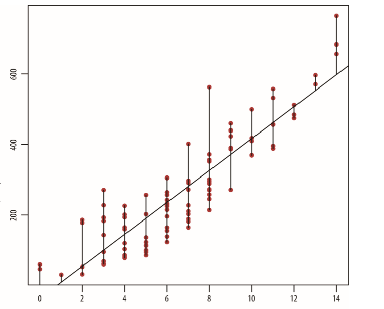

[toc]
##第三章 算法
数据科学里必须要了解的算法：
1. 数据清理和预处理的算法（数据过程）。比如排序、MapReduce、Pregel
2. 用于参数估计的最优化算法。比如随即梯度下降(Stochastic Gradient Descent)、牛顿法、最小二乘法。
3. 机器学习算法
   

### 3.1机器学习算法
机器学习算法的应用主要有三个方面：预测、分类和聚类
### 3.2 三大基本算法
#### 3.2.1 线性回归模型
从根本上来说，想表示两个变量之间的数学关系时，就可以使用线性回归。使用线性回归时，首先要假设输出变量（因变量，标签）和预测变量（自变量，特征）之间存在线性关系。（多元线性回归，一个输出变量和多个预测变量之间存在关系）

理解线性回归的一个切入点是先确定那条直线。假设两个变量之间的关系是线性的，因此模型的形式可以表示为：
$$y=\beta_0+\beta_1x$$
接下来就是在给定数据样本$(x_1,y_1)$,$(x_2,y_2)$,...,$(x_n,y_n)$的情况下，确定最佳的截距($\beta_0$)和斜率($\beta_1$)的估计值。

线性模型也可以用矩阵来表示：
$$y=x*\beta$$
其中$x$是数据矩阵，$\beta$是参数向量。任务就是找一条最佳的直线（参数向量估计值）拟合数据。

##### 模型拟合
参数向量如何估计？一个直观的想法是：如果存在一条最佳拟合的直线，那么所有样本数据点到这条直线的距离应该是所有直线中最小的。

如图，假设数据点的$y$值用$y_i$表示，其在直线上的拟合值（预测值）为$\hat y_i$，那么一个样本点与其拟合值的距离可以定义为两个点在$y$值上的 “离差平方”：$(y_i-\hat y_i)^2$。所有数据点的距离之和也称作“离差平方和”： $\sum(y_i-\hat y_i)^2$。最优的那条直线具有最小的“离差平方和” 。可以看出，这里距离的定义，也就是“离差平方和” 还可以解释为模型的预测误差。这样的估计方法就是著名的**最小二乘估计法**。\

离差平方表示为RSS(Residual Sum of Squares),可以表示为：
$$RSS(\beta)=\sum_i(y_i -\beta x_i)^2$$

$i$表示某个数据点。离差平方和是一个关于$\beta$的函数。为了找到最优的$\beta$，需要最小化离差平方和。

利用微积分，对$RSS(\beta)$针对$\beta$求导并令其为0即可找到可能的最优解$RSS(\beta)=(y-\beta x)^t(y-\beta x)$,可以得到：
$$\hat \beta=(x^tx)^{-1}x^ty$$
$\hat \beta$代表 $β$ 的估计值，真实的$β$是无从得知的。在得到$β$估计值的表达式之后，主要将观测数据的值代入即可计算出实际的估计值。

这样就可以求出模型最终的最优估计直线。

至于到底能否采纳这个线性模型，将它用于数据关系描述和结果预测，这取决于我们的判断。一个自然的问题是，对得到的预测值，我们有多大的自信认为它很接近真实值？

这在统计学上叫置信值的问题。因此，线性模型得到的预测值只是所有可能的预测值的一个总体趋势，而围绕这个趋势的波动性还没有被模型考虑进来。

##### 最小二乘模型的延伸
上面讨论的是一个简单的线性回归模型（一个输出变量，一个预测变量），模型参数的预测采用了最小二乘法来估计$β$。在此模型的基础上，我们可以从三个方面进行延伸：

1. 增添关于模型误差项的假设
2. 增添更多的预测变量
3. 对预测变量加以判断

###### 增添关于模型误差项的假设
如果只是应用线性模型预测给定$x$值情况下的$y$值，那么得到的预测值只是一个确定值这就忽视了预测必然存在的可变性。

对于一个给定$x$的预测情况，$y$的值是不定的。为了让模型捕捉数据中的不确定性，可以将模型的形式扩展为：
$$y=\beta_0+\beta_1x+\epsilon$$
其中$\epsilon$是模型中新加的项。也叫做“噪声”项，代表数据中不能被模型拟合的部分。它也称为误差项—— $\epsilon$代表模型的实际误差，也就是实际观测值与真实回归直线上所得值的误差。真实的回归直线永远是未知的。我们只能通过$\hat \beta$估计。

我们通常假设该残差服从一个均值为0，方差未知的正态分布，有：
$\epsilon$  ~ $N(0,\sigma^2)$

在误差项的正态分布假设下，我们可以从条件分布的角度解释线性回归模型。也就是说，对于给定的$x$,$y$的条件分布是一个正态分布：

$p(y|x)$ ~ $N(\beta_0+\beta_1x,\sigma^2)$

假设x=5，也就是说y服从一个正态分布，均值为$y=\beta_0+\beta_1*5$，方差为$\sigma^2$。其中$\beta_0$、$\beta_1$以及$\sigma^2$的值需要从数据里估计。
